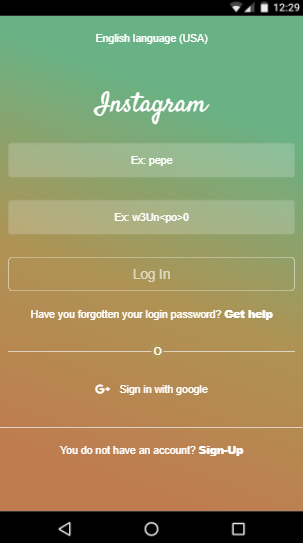
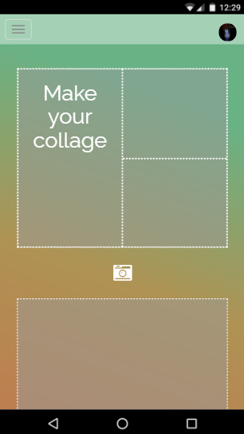
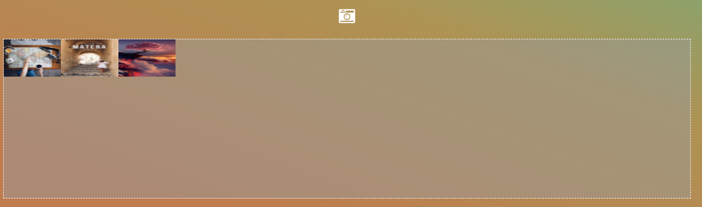
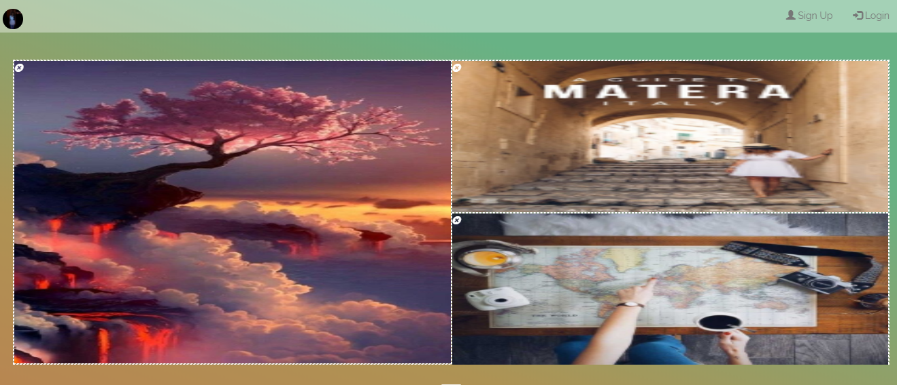
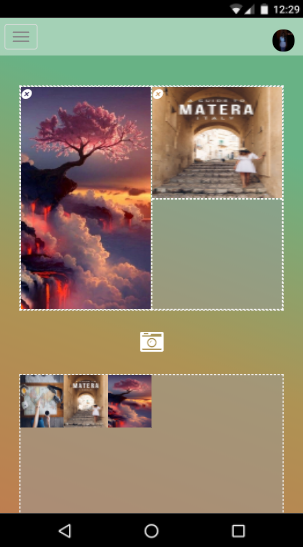
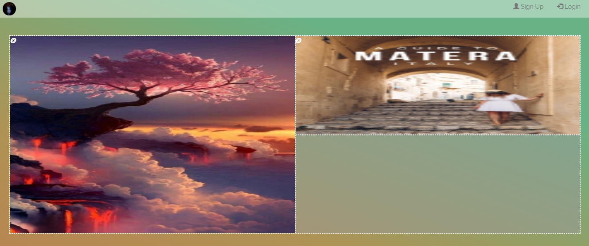

# Insta Collage

The present work consists of the user makes a collage with the photos that he or she wants. The platform is suitable for mobile and computer desk.

## Team

- Araceli Cueva
- Betsy Vidal
- Melissa Yauri

## Herramientas Utilizadas

- Html5
- API Drag and Drop.
- Css
- Javascript
- Jquery
- Bootstrap

## Environment
The project was worked on the Windows 10 operating system (64 Bits).

## Flow of the application
- **Log In view** : This view allows you to register through your Gmail

 

 

- **Collage view**: This view will allow you to make your own collage

 

  - First select your photos through the camera icon

   

  - Then drag the photos to the collage box

    

    

  - You can also delete the photo from your collage with the x button

   

## Bibliographical sources
[Firebase](https://firebase.google.com/docs/storage/web/upload-files?authuser=0)
